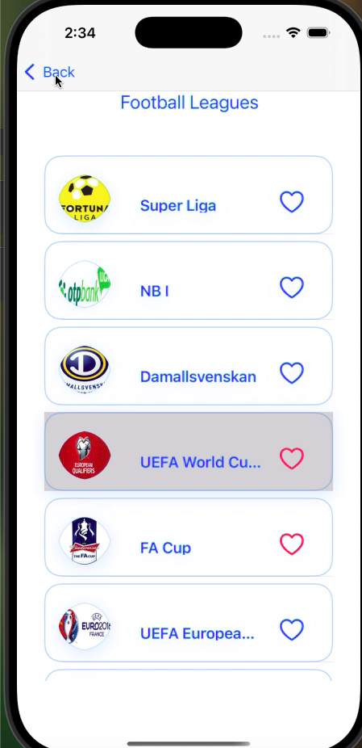

Shoot - The Ultimate iOS Sports Companion
Shoot is your smart gateway into the world of sports. 
Designed exclusively for iOS and built with using Swift, the app brings global sports data to your fingertips in a sleek, responsive, and intuitive experience.

Whether you’re a die-hard football fan, a basketball enthusiast, or just keeping up with your favorite team, Shoot is here to keep you updated, even when you're offline.

---

🚀 Highlights

- Structured using MVP (Model-View-Presenter)
- Fast & fluid UI with native Swift 
- Smooth animations & feedback powered by Lottie and Shimmer
- Offline capabilities through CoreData
- Fully localized & supports dark mode

 App Structure

🏠 Home Interface (Tabs)

- Sports Explorer: Browse across a wide range of sports (football, tennis, basketball, cricker) fetched in real-time from [AllSportsAPI](https://allsportsapi.com/)
- Favorites Hub: Access your starred leagues—persisted locally so you never lose them, even when offline.

🏆 League Center

- Discover all leagues related to a selected sport.
- Easily mark your favorite leagues with one tap.
- Dynamic navigation to full league details.

📅 Match Events

Three segmented sections displayed in a modern compositional layout:
- Upcoming Matches** – Who’s playing next and when.
- Recent Matches** – Final scores and highlights.
- Teams View – Club logos & details within the selected league.

👕 Team Insights

- Dive into a team's profile: logo, name, history, and more.
- Clean and elegant layout ensuring a focused fan experience.

---
Architecture & Testing

Shoot is engineered with:
- MVP for separation of concerns and scalable components.
- XCTest for unit testing across major layers.

# ⚙️ Tech Stack

| Tool/Framework     | Purpose                          |
|--------------------|----------------------------------|
| Swift              | Primary programming language     |
| Alamofire          | Networking & API consumption     |
| CoreData           | Offline storage for favorites    |
| Kingfisher         | Image loading & caching          |
| AutoLayout         | Responsive UI Design             |
| Lottie             | Animated Onboarding              |
| Reachability       | Internet status monitoring       |
| Shimmer            | Loading placeholders             |
| XCTest             | Unit Testing                     |

---
📸 Demo Screens

| Splash | Onbording | Home |
|------|---------|--------|
|  |  |  |

|  Footbal Leagues | Basketball Leagues | Tennis Leagues |
|----------|-----------|-------|
|   |  |  |

| Match Details | Match Details | Team Details |
|----------|-----------|-------|
|  |  |  |

| No Favorites |  Favorites | Delete Confirmation |
|--------------|------------|---------------------|
|  |   |  |

| No Matches | Shimmer | No Internet |
|--------------|-----------|-------------|
|  |   |  |

